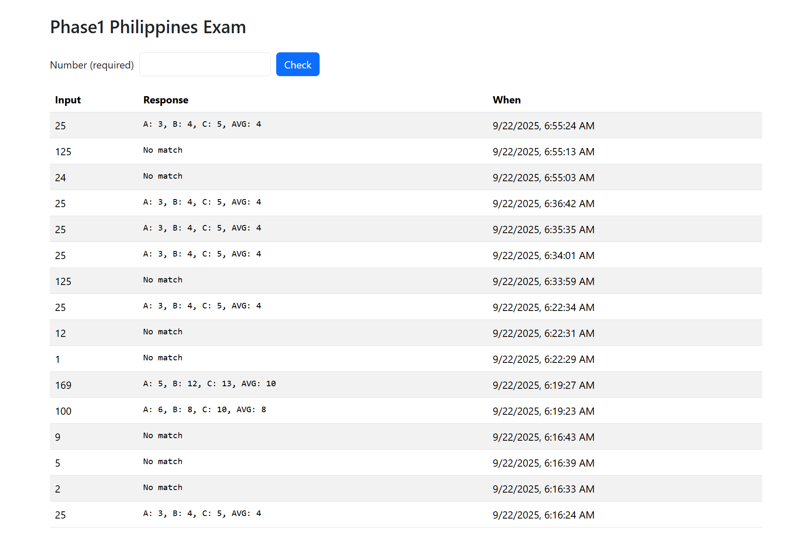

# Phase1 Philippines Exam Solution

Technical exam solution for Phase1 Philippines. A Spring Boot + Bootstrap web application with MySQL backend.

## Prerequisites

- Java 17
- MySQL

## Setup

1. Clone or unzip the project.
2. Create a database named `check_db` in MySQL.
3. Update `src/main/resources/application.properties` with your MySQL username and password.
4. Run the application: `mvn spring-boot:run`.
5. Open http://localhost:8080 in your browser.

## DDL
```sql
CREATE DATABASE IF NOT EXISTS check_db CHARACTER SET utf8mb4 COLLATE utf8mb4_unicode_ci;
```

-- Note: I used JPA / Hibernate :))

## API Endpoints

- `POST /api/check`: 
    - Checks if the number is a perfect square and if it can be expressed as c² in (a² + b² = c²). 
    - Returns a JSON object with a, b, c, and avg if found, otherwise returns an empty object.

- `GET /api/records`: 
    - Returns all records stored in the database.

## Sample Requests

```
curl -X POST "http://localhost:8080/api/check" \
  -H "Content-Type: application/json" \
  -d '{"value": 25}'
```

```
curl -X GET "http://localhost:8080/api/records"
```


## Frontend

Single HTML page with Bootstrap and jQuery.
- Allows the user to input a number
- See the history of checks in a table.

## Sample Output

